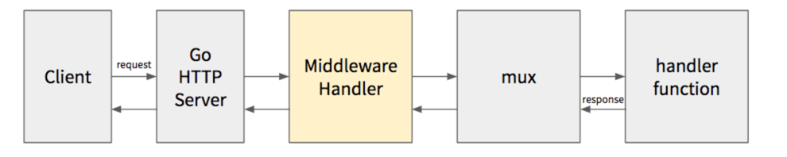

# This is a web project in golang, where we will try to use multiple concepts
##List of all the dependencies we have used in this project

| Name | GoCommand| References |
| -----|----------| -----------|
| [Gorilla Mux](https://github.com/gorilla/mux) | go get github.com/gorilla/mux |
| [GoRedis](https://github.com/go-redis/redis) | go get github.com/go-redis/redis/v8 |
| [Gorilla Sessions](https://github.com/gorilla/sessions)| go get github.com/gorilla/sessions|
| [Bcrypt](https://github.com/golang/crypto) | go get golang.org/x/crypto/bcrypt|
| [Middleware]() | 

## Middleware to extract out boiler-plate code
Without middleware, we are technically repeating the validating session code in every http handler.

When middleware comes into picture, the http requests are being intercepted before going to `mux -> handler`
and after receiving the request on Go Web Server
